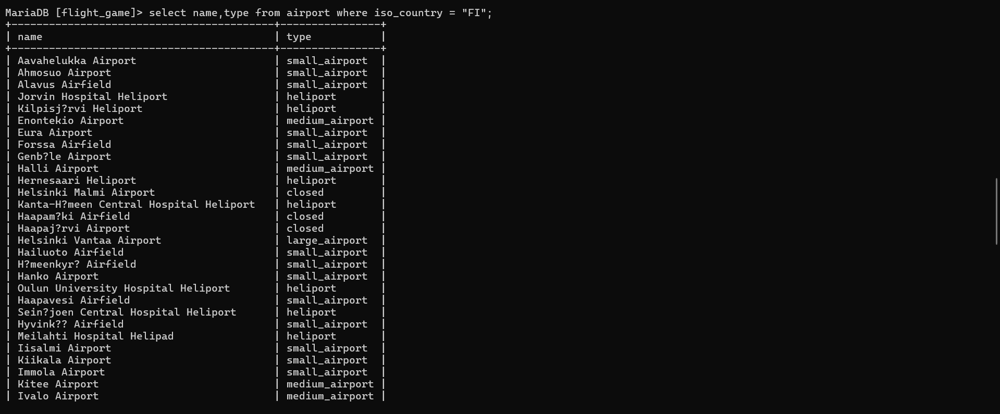
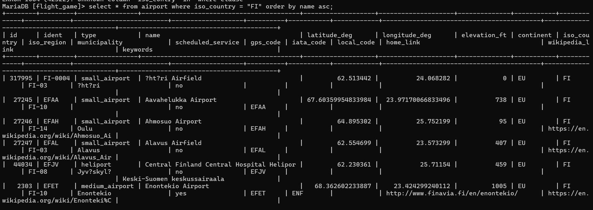
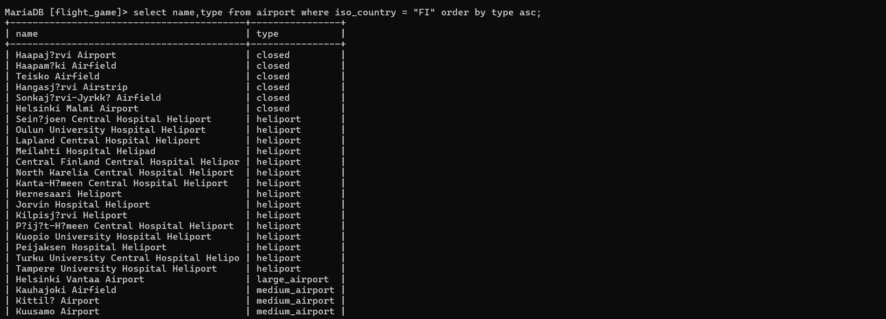
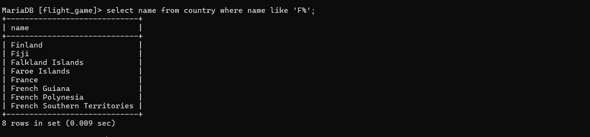
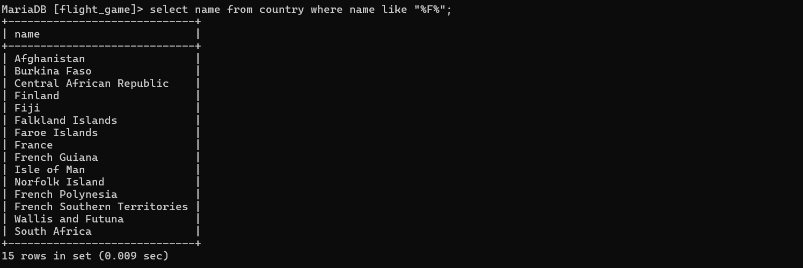
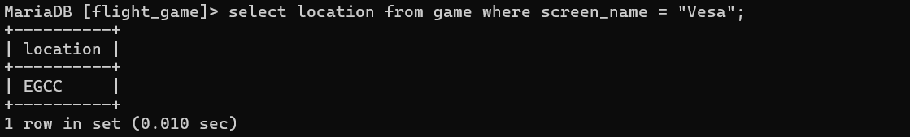
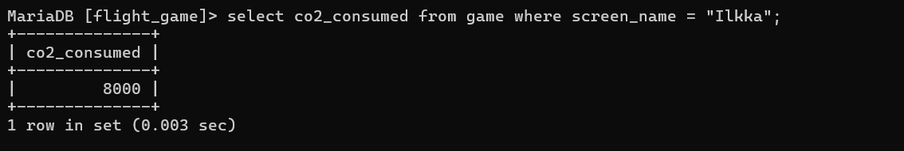
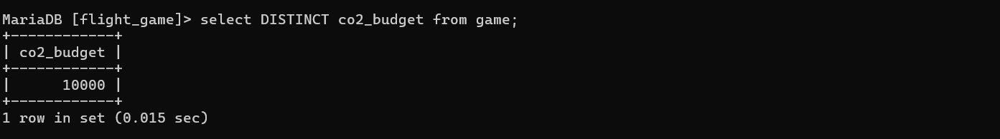
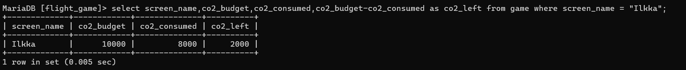

#week 3, Exercise 2

### Q1
Select * form goal;

### Q2
select name,type from airport where iso_country = "FI";

### Q3
select * from airport where iso_country = "FI" order by name asc;

### Q4
select name,type from airport where iso_country = "FI" order by type asc;

### Q5
select name from country where name like 'F%';

### Q6
select name from country where name like "%F%";

### Q7
select location from game where screen_name = "Vesa";

### Q8
select co2_consumed from game where screen_name = "Ilkka";

### Q9
select DISTINCT co2_budget from game;

### Q10
select screen_name,co2_budget,co2_consumed,co2_budget-co2_consumed as co2_left from game where screen_name = "Ilkka";

