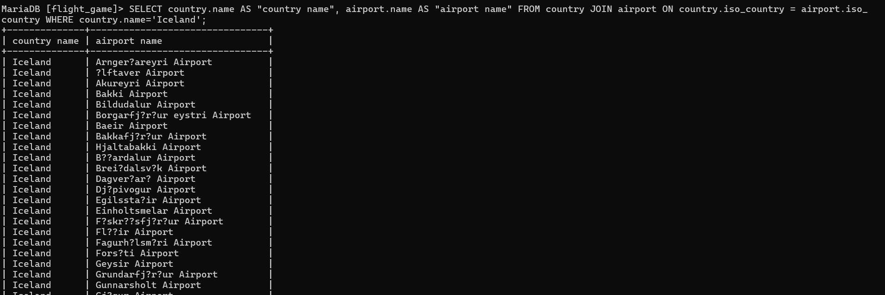
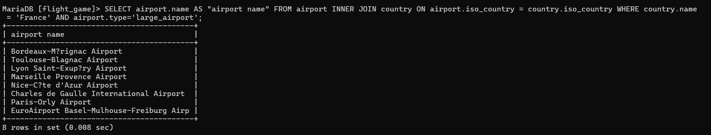
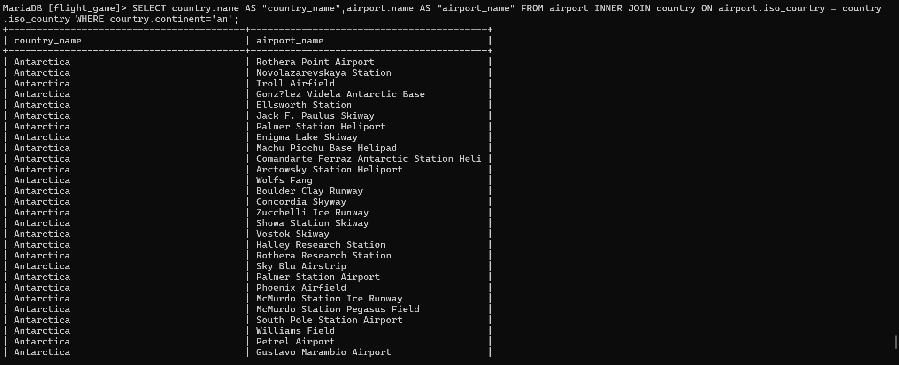
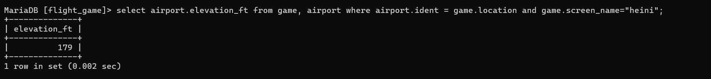
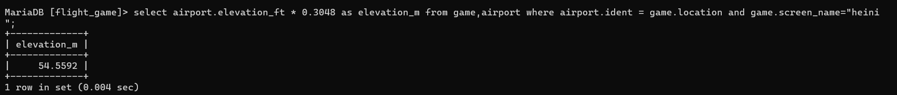
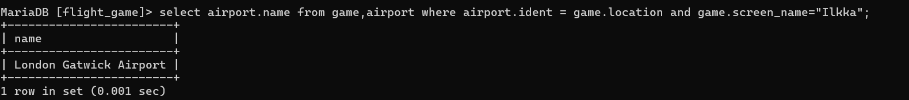
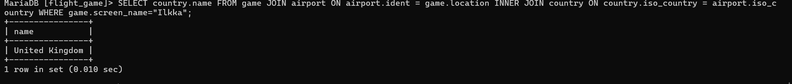
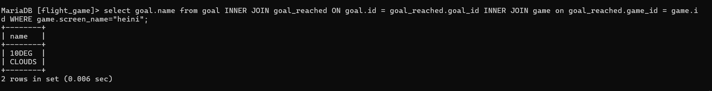
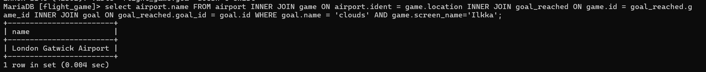
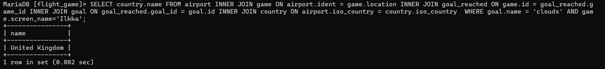

Q1)
SELECT country.name AS "country name", airport.name AS "airport name" FROM country JOIN airport ON country.iso_country = airport.iso_country WHERE country.name='Iceland';

Q2)
SELECT airport.name AS "airport name" FROM airport INNER JOIN country ON airport.iso_country = country.iso_country WHERE country.name = 'France' AND airport.type='large_airport';

Q3)
SELECT country.name AS "country_name",airport.name AS "airport_name" FROM airport INNER JOIN country ON airport.iso_country = country.iso_country WHERE country.continent='an';

Q4)
select airport.elevation_ft from game, airport where airport.ident = game.location and game.screen_name="heini";

Q5)
select airport.elevation_ft * 0.3048 as elevation_m from game,airport where airport.ident = game.location and game.screen_name="heini";

Q6)
select airport.name from game,airport where airport.ident = game.location and game.screen_name="Ilkka";

Q7)
SELECT country.name FROM game JOIN airport ON airport.ident = game.location INNER JOIN country ON country.iso_country = airport.iso_country WHERE game.screen_name="Ilkka";

Q8)
select goal.name from goal INNER JOIN goal_reached ON goal.id = goal_reached.goal_id INNER JOIN game on goal_reached.game_id = game.id WHERE game.screen_name="heini";

Q9)
select airport.name FROM airport INNER JOIN game ON airport.ident = game.location INNER JOIN goal_reached ON game.id = goal_reached.game_id INNER JOIN goal ON goal_reached.goal_id = goal.id WHERE goal.name = 'clouds' AND game.screen_name='Ilkka';

q10_)
SELECT country.name FROM airport INNER JOIN game ON airport.ident = game.location INNER JOIN goal_reached ON game.id = goal_reached.game_id INNER JOIN goal ON goal_reached.goal_id = goal.id INNER JOIN country ON airport.iso_country = country.iso_country  WHERE goal.name = 'clouds' AND game.screen_name='Ilkka';
