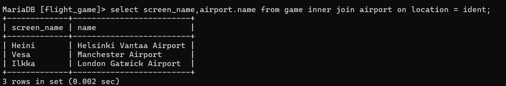
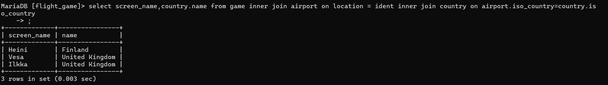
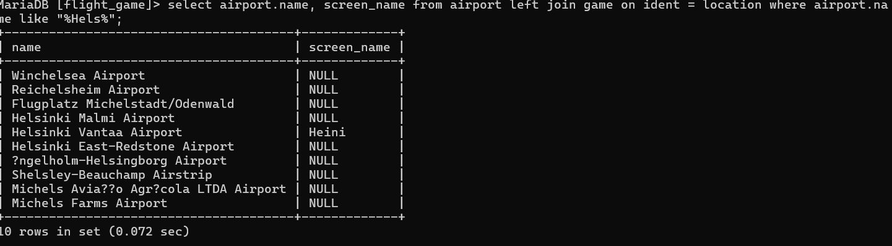
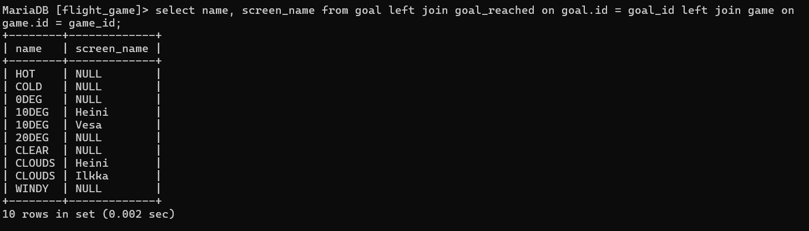

Q1)
Select country.name as "country name", airport.name as "airport name" from country inner join airport on airport.iso_country = country.iso_country where country.name = "Finland"and scheduled_service = "yes";

Q2)
select screen_name,airport.name from game inner join airport on location = ident;

Q3)
select screen_name,country.name from game inner join airport on location = ident inner join country on airport.iso_country=country.iso_country

Q4)

select airport.name, screen_name from airport left join game on ident = location where airport.name like "%Hels%";

q5)
select name, screen_name from goal left join goal_reached on goal.id = goal_id left join game on game.id = game_id;

 