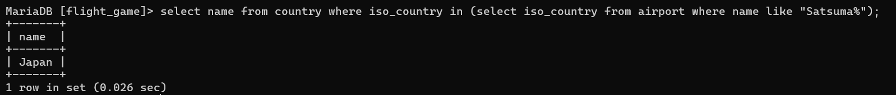
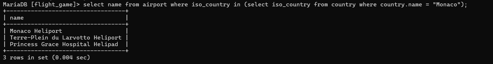
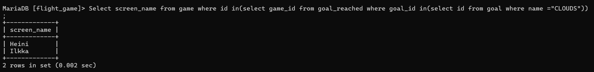
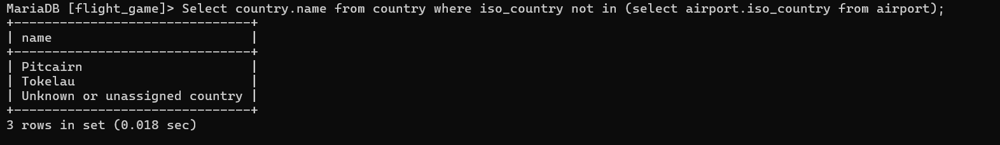
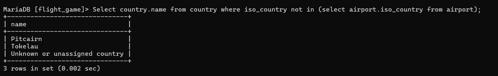

q1)
select name from country where iso_country in (select iso_country from airport where name like "Satsuma%");

q2)
select name from airport where iso_country in (select iso_country from country where country.name = "Monaco");

q3)
Select screen_name from game where id in(select game_id from goal_reached where goal_id in(select id from goal where name ="CLOUDS"));

q4)
Select country.name from country where iso_country not in (select airport.iso_country from airport);

q5)
Select country.name from country where iso_country not in (select airport.iso_country from airport);
