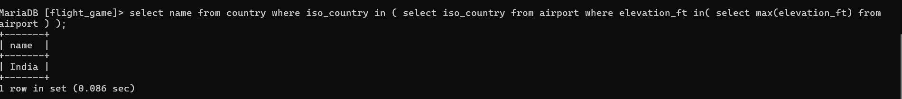

q1)
select continent, count(*) from country group by continent;

q2)
select continent, count(*) from country group by continent;

q3)
select screen_name, count(*) from game, goal_reached where id = game_id group by screen_name;

q4)
select screen_name from game where co2_consumed in(select min(co2_consumed) from game );

q5)
select country.name, count(*) from airport, country where airport.iso_country = country.iso_country group by country.iso_country order by count(*) desc limit 50;

q6)
select country.name from airport, country where airport.iso_country = country.iso_country group by country.iso_country having count(*) > 1000;

q7)
select name from airport where elevation_ft in ( select max(elevation_ft)from airport);

q8)
select name from country where iso_country in ( select iso_country from airport where elevation_ft in( select max(elevation_ft) from airport ) );

Q9)
select count(*) from game, goal_reached where id = game_id and screen_name = "Vesa" group by screen_name;